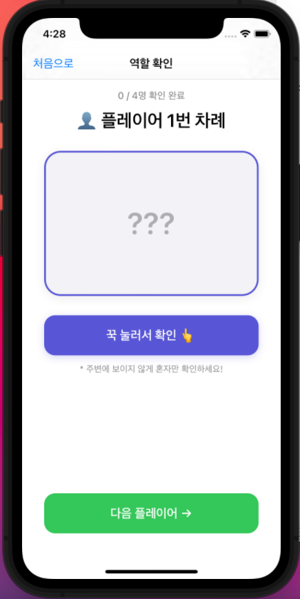
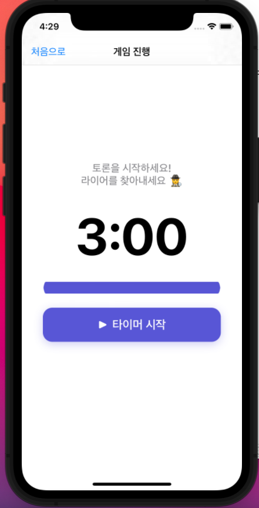
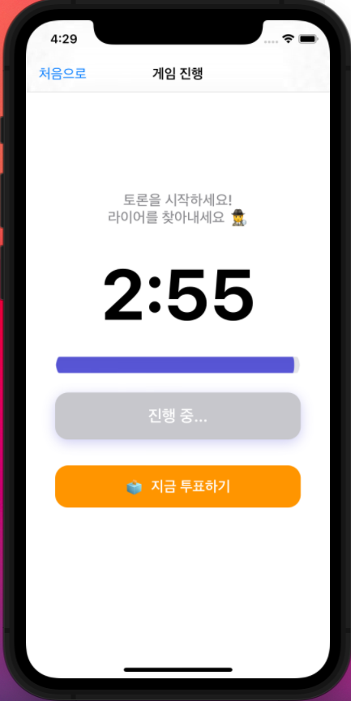
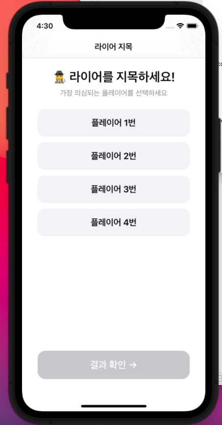
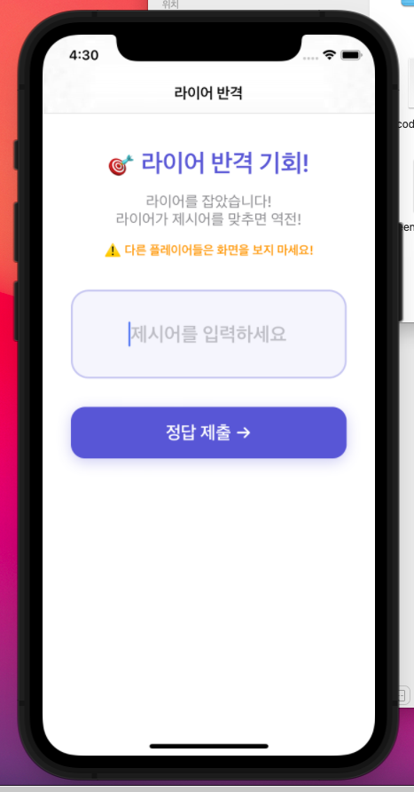

# 🎭 LIAR MASTER

> 오프라인 보드게임 "라이어 게임"의 사회자 역할을 대신해주는 iOS 앱

---
## 🎬 시연 영상

[](https://youtu.be/yppFWBwDi_Y?si=eJ2fk6_7o7ggmUoo)

🔗 **영상 링크**: https://youtu.be/yppFWBwDi_Y?si=eJ2fk6_7o7ggmUoo
## � 스크린샷

| 게임 설정 | 역할 확인 | 타이머 | 타이머 진행 |
|:---------:|:---------:|:------:|:-----------:|
|  |  |  |  |

| 라이어 지목 | 최종 결과 (라이어 승) | 라이어 반격 | 최종 결과 (역전승) | 최종 결과 (시민 승) |
|:-----------:|:--------------------:|:-----------:|:-----------------:|:------------------:|
|  |  |  |  |  |

---

## �📌 프로젝트 개요

별도의 사회자 없이 스마트폰 한 대만으로 라이어 게임을 진행할 수 있습니다.  
단어 선정, 역할 배정, 타이머 관리까지 자동으로 처리해줍니다.

---

## 📱 주요 기능

### 1. 게임 설정 화면
- `UIStepper`로 총 인원 및 라이어 인원 수 조절
- `UISegmentedControl`로 카테고리 선택 (음식 / 영화 / 동물)
- 라이어 수 ≥ 총 인원일 경우 자동 제한 및 경고 팝업

### 2. 역할 확인 화면
- 플레이어 순서대로 화면을 돌려가며 확인
- **꾹 누르는 동안에만** 역할/제시어 공개 (`touchDown` / `touchUpInside`)
- 진행 상황 표시 (N / N명 확인 완료)
- 상단 "처음으로" 버튼으로 설정 실수 시 복귀 가능

### 3. 게임 진행 화면
- 3분 카운트다운 타이머
- `UIProgressView`로 시각적 진행률 표시
- 30초 이하 시 빨간색 경고 + 깜빡임 효과
- **"지금 투표하기"** 버튼으로 타이머 종료 전 조기 투표 가능

### 4. 결과 공개 화면
- 라이어 번호 스프링 애니메이션으로 공개
- 정답 제시어 표시
- "다시 하기" 버튼으로 게임 루프

---

## 🏗 기술 스택

| 항목 | 내용 |
|------|------|
| 언어 | Swift 5 |
| UI 구성 | UIKit (코드 기반, 스토리보드 미사용) |
| 아키텍처 | MVC |
| 최소 타겟 | iOS 14.0 |
| 개발 도구 | Xcode 13+ |

---

## 🗂 화면 구조

```
HomeViewController (게임 설정)
    └─ CardViewController (역할 확인)
            └─ TimerViewController (게임 진행)
                    └─ ResultViewController (결과 공개)
                            └─ (popToRoot) HomeViewController
```

---

## 🚀 실행 방법

1. 저장소 클론
```bash
git clone https://github.com/hs-2171245-chanhyukmin/LiarMaster.git
```
2. Xcode에서 `final_project.xcodeproj` 열기
3. Swift 파일 5개를 프로젝트에 추가 (Add to targets 체크)
4. `Info.plist`의 Storyboard Name 항목 삭제
5. `SceneDelegate.swift`의 `scene(_:willConnectTo:)` 함수 교체 (SETUP_GUIDE.swift 참고)
6. `Cmd + R`로 실행

---

## 📂 파일 구조

```
LiarMaster/
├── Models.swift               # 데이터 모델 + 단어 뱅크 + 역할 생성 로직
├── HomeViewController.swift   # 게임 설정 화면
├── CardViewController.swift   # 역할 확인 화면
├── TimerViewController.swift  # 타이머 화면
└── ResultViewController.swift # 결과 공개 화면
```

---

## 👤 개발자

| 학번 | 이름 |
|------|------|
| 2171245 | 민찬혁 |
